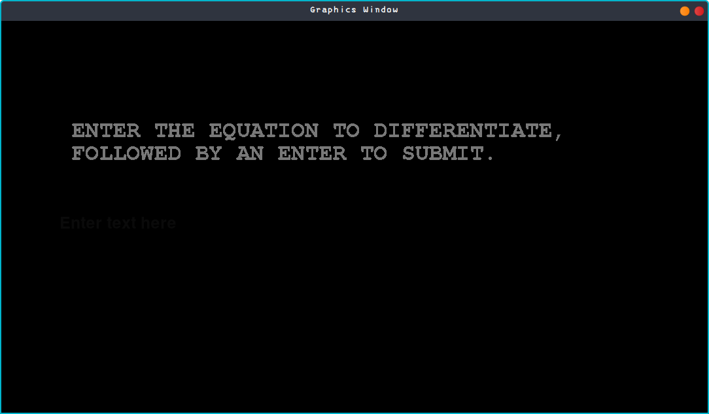

# Final Project Computation Mathematics

- Naufal Basyah -
- Imanuel Febie - 2201835800

This repository contains the final project for our Computational Mathematics course. Please install the required packages that are already inside the *requirements.txt*. This small project depends on these to able to run. We recommend using a virtual environemnt and pip to manage and install the python packages. With pip installed on your local machine, you should be able to run the following command inside your bash terminal (make sure you are in the right folder):

```bash
pip3 install -r requirements.txt
```

